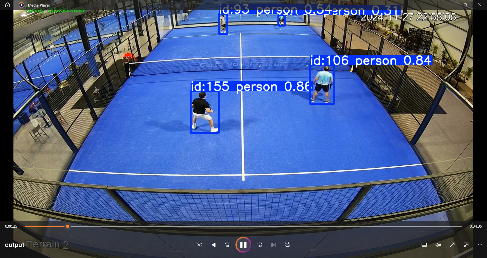

# AI/ML Internship Technical Assessment Submission for Layman AI

## Project Overview

This project is a Computer Vision based sports analytics prototype developed for the Layman AI Internship Assignment.

The system processes padel gameplay footage and performs:
- Player detection
- Ball detection
- Object tracking
- Basic shot classification
- CSV analytics generation

The goal of the project is to demonstrate practical AI/ML pipeline development using real-world video data.

---

# Technologies Used

- Python
- OpenCV
- YOLOv8 (Ultralytics)
- Pandas
- NumPy

---

# Features

## Object Detection
The system detects:
- Players
- Sports ball

using the YOLOv8 pretrained model.

---

## Object Tracking
YOLO tracking functionality is used to maintain tracking IDs for detected players across video frames.

---

## Shot Classification
A simple rule-based shot classification approach was implemented based on ball movement.

Shot categories:
- Forehand
- Backhand
- Smash

---

## Output Generation

The system generates:
- Annotated output video
- CSV file containing shot analytics

---

# Project Structure

```bash
padel-ai-project/
│
├── input/
│   └── input.mp4
│
├── output/
│   ├── output.mp4
│   └── shot_analysis.csv
│
├── models/
├── main.py
├── requirements.txt
└── README.md
```

---

# Installation

Install required libraries:

```bash
pip install -r requirements.txt
```

---

# Run Project

```bash
py main.py
```

---

# Challenges Faced

- Detecting small fast-moving sports ball
- Maintaining stable object tracking
- Handling rapid player movement
- Creating simple shot classification logic

---

# Future Improvements

- Deep learning based shot classification
- Pose estimation integration
- Better ball tracking
- Real-time analytics dashboard
- Player movement heatmaps

---

# Conclusion

This project demonstrates a basic but functional sports analytics pipeline using Computer Vision and Machine Learning concepts.

The prototype successfully performs:
- Object detection
- Tracking
- Shot classification
- Analytics generation

while maintaining a simple and scalable architecture.

---

# Input Video

Google Drive Link:
https://drive.google.com/file/d/1wHPvqWPMBJY4YiVujrBK3C0xJSclzKQ-/view?usp=sharing

---

# Output Demo Video

Google Drive Link:
https://drive.google.com/file/d/111Dd6VhAAuR3IJ1LOgoGvnECj1F7qSl5/view?usp=sharing

---

# Output Preview

)
